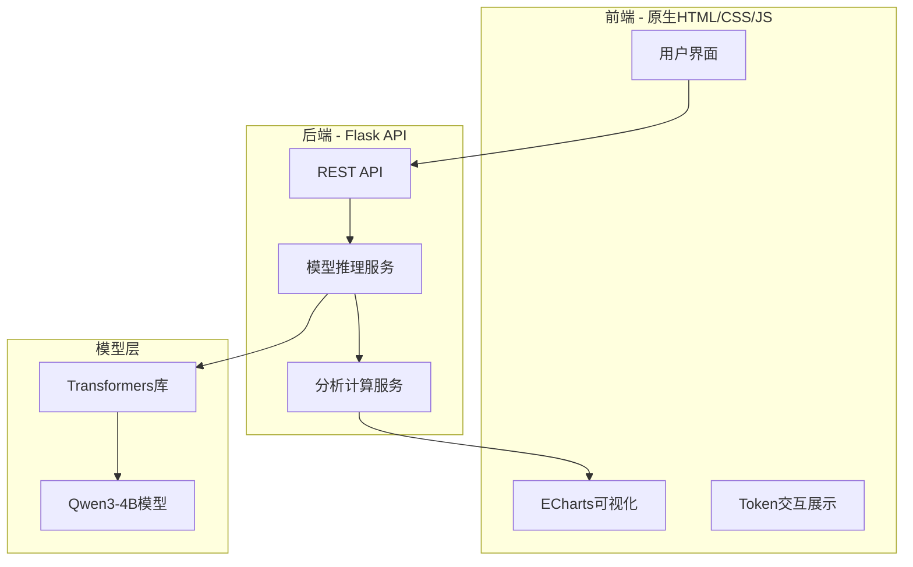

# LLM 推理可视化工具开发计划

## 架构设计




## 技术选型

| 组件 | 技术 ||------|------|| 后端框架 | Flask || 推理库 | transformers (4.57.3) || 前端 | 原生 HTML/CSS/JavaScript || 可视化 | ECharts || 模型 | ~/evo/models/qwen3-4b-instruct-2507/ |

## 项目结构

```javascript
llmvis/
├── app.py                 # Flask 主应用
├── model_service.py       # 模型加载与推理服务
├── analysis.py            # 熵计算、概率分析等
├── static/
│   ├── css/
│   │   └── style.css      # 样式文件
│   └── js/
│       ├── main.js        # 主逻辑
│       ├── charts.js      # ECharts 图表封装
│       └── api.js         # API 调用封装
├── templates/
│   └── index.html         # 主页面
├── requirements.txt       # Python 依赖
└── README.md              # 项目说明
```


## 核心功能实现

### 1. 模型推理服务 (model_service.py)

- 使用 `transformers` 加载 Qwen3-4B 模型
- 推理时设置 `output_attentions=True` 和 `output_hidden_states=True`
- 返回 logits 用于计算概率分布
- 支持 temperature、top_k、top_p、max_tokens 参数

### 2. 注意力热力图 (第N层)

- 提取指定层的注意力矩阵 `model.outputs.attentions[layer_idx]`
- 支持多头注意力的聚合（平均/最大）或单独查看
- 使用 ECharts heatmap 渲染

### 3. Token 概率分布

- 对每个生成位置的 logits 应用 softmax
- 取 top-N 概率最高的 token
- 点击 token 时展示柱状图

### 4. 熵分析

- 计算公式: `H = -sum(p * log(p))`
- 展示单 token 熵值
- 展示整体熵分布曲线

### 5. 额外探测功能

- Hidden states 余弦相似度（层间变化）
- Token embedding 可视化（降维投影）
- 生成概率置信度曲线

## API 设计

| 端点 | 方法 | 功能 ||------|------|------|| `/api/generate` | POST | 执行推理，返回完整分析数据 || `/api/attention` | GET | 获取指定层注意力矩阵 || `/api/token_probs` | GET | 获取指定位置的 top-N token 概率 |

## 前端界面设计

采用深色主题，简约专业风格：

- 左侧：输入区 + 参数控制面板
- 中间：对话展示区（token 可点击交互）
- 右侧：可视化面板（可切换：注意力热力图/概率分布/熵分析）

## 实现步骤

1. **初始化项目**：创建目录结构，初始化 git 仓库
2. **后端核心**：实现模型加载和推理服务
3. **分析模块**：实现熵计算、概率提取等分析功能
4. **API 层**：实现 Flask REST API
5. **前端基础**：创建 HTML 结构和 CSS 样式